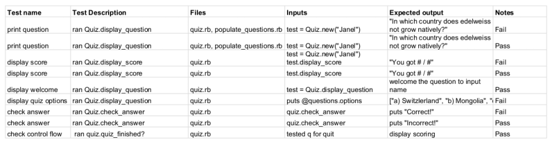

# The Geo Quiz App

GitHub Repository Link: https://github.com/t-hnh10/terminal-app

## Description

### Purpose

The purpose of '**The Geo Quiz App**' is to assess a user's knowledge in connection with our wider world, to discover new insights and push the limits of human knowledge to a realm unmatched by any other!

In order to achieve this goal of peak intellect, the terminal application posits itself as a quiz that challenges a user with geography-related questions and scores said user with the magic of built-in functions.

### Functionality

Upon launch, the name of the user is requested. Once the name has been inputted, there are two basic options:
- Firstly, the user may quit the application; or
- Secondly, the user may start answering some questions.
(Not sure why you would not want to push the limits of human knowledge!)

The terminal application is simple in nature, for more reasons than one. Most importantly, options provided to the user are kept to a minimum in order to maximise the efficiency of the application's purpose. That is, to allow fellow earthlings to learn with minimal accessibility concerns (including those who do not consider themselves computer literate).

### Instructions

In order to execute the application (and begin your exciting learning journey), please follow the instructions below.

Downloading the application:
1. Navigate to the GitHub repository as linked above; and
2. Either **clone** or **download the ZIP** of the application.

Ensuring appropriate gems are installed:
1. Ensure you have ***bundler*** installed by opening Terminal and entering `bundler -v`.
    1. If not (and an error is returned), enter the following command to install: `gem install bundler`.
2. Navigate to the project root directory in Terminal and install all of the required gems with the following command: `bundle install`.

Running the application:
1. In Terminal, ensure your working directory is within the `src` folder.
2. Simply enter the following command: `ruby main.rb`; and
2. Enjoy!

### Screenshots

### Future enhancements
- Create a User class that will be able to store a player's login details, password and game save data to an external file;
- Create multiple difficulty levels and have corresponding sets of questions to those levels; and
- Use of other gems (e.g. tty-prompt) in order to provide improved formatting, text readability, and easier/intuitive user interaction.
  
### Accessibility concerns

Accessibility is and has always been a key part of the application's philosophy, ingrained in its simple nature. The application provides a minimal amount of prompts before a user may enter its main function (that is, for the user to start being quizzed).

However, one specific concern arose from the use of the 'artii' gem for the title text. The original name of the application was 'The Geography Quiz App', not overly creative but incredibly unwieldy. The title was far too long, where we could no longer ensure most users would experience appropriate sizing within their terminal. Additionally, and quite simply, it was difficult to read even to those of ordinary sight. Thus, the application was renamed and made more *accessible*.

### Potential social concerns

As a quiz application with basic functionality, it is not immediately evident whether there are any social concerns (whether they be legal, moral, ethical, cultural, political, etc).

However, the questions that were provided to the quiz application were handpicked and, as such, prone to bias. As the questions are centered upon the topic of geography, the two largest potential concerns related to cultural and political issues.

For example, the specific topics we refer to within our questions may be considered taboo, offensive or objectionable by a certain group of people. Certain examples are listed below:
- Territorial sovereignty
    - Many regions of the world are disputed between nations (e.g. Taiwan, Arunachal Pradesh, Senkaku Islands, Gibraltar, etc)
- Religion
    - Reference to controversial passages within religious text
- Demography
    - Stating the existence of certain groups of people and their population numbers in some territories may be considered inflammatory (e.g. the Rohingya in Myanmar)

## Design & Planning Process

### App Idea Brainstorming

The brainstorming component of the project occurred primarily on *17 April 2019*. A collaborative Google Doc was created where both parties could access and provide input. Screenshots may be found below:

On *23 April 2019*, we brainstormed application specifics such as possible implementations (e.g. how to store our question data). Below are images of that aspect where assistance was provided by Varsha and Janel.

### User Stories

The following user stories were formulated:
- US-1: As a Quiz app, I can welcome the user and ask for their name, then create a personalised greeting.
- US-2: As a Quiz App, I can quiz the user with questions.
- US-3: As a Quiz App, I can tally the total points of the user and print their score.
- US-4: As a user, I can choose to answer questions provided by the quiz or quit at any time.

### App Control Flow

Original control flow:

During the review period, we encountered a less than ideal situation where the app would end suddenly. The user is not given an option to be provided with a new set of questions and play again. This problem required us to revisit the application flowchart. After an update to the flowchart, it became clear a new loop was necessary in order to give the user the option to play again. This can be seen below:

Updated control flow:

### Project Plan & Timeline

### Overall App Design Description

The application design was straightforward and followed the process as established in our Trello Board. It may be described as follows:
1. A GeoQuestion class was created that essentially acts as a data structure for which we could code questions following that defined template. The class was defined to accept three elements, namely the question, (multiple choice) options and the (correct) answer.
2. A new file titled 'populate_questions.rb' was created in order to hold a method that would randomly generate a question. This was achieved in several steps:
    - A method called 'get_questions' was defined and setup to accept an element. This element will determine the number of questions generated when the 'get_questions' method is called.
    - An array was created. Inside this array, new instances were created while calling the GeoQuestion class. As noted above, this class expects three (3) elements which are hardcoded into the new instance. That is, the question, options, and answer.
    - After the array, the '.sample' method is called upon the array to generate the random question.
3. A Quiz class was created. This class initializes certain instance variables including @questions, @next_question, @score and @player. Certain methods are also defined; these methods deliver the core function of the app in displaying the question to the user, checking the answer, displaying the score, and determining whether there are remaining questions to display to the user.
4. A 'main' app was then created in order to incorporate the different components of the Quiz App together. The main app itself is quite minimal, calling on methods defined in the Quiz class. These methods were incorporated within a 'while loop' that will continue to run while there are remaining questions. It also allows the user to break from the loop and quit the application at any time.
5. Throughout the design process, we continually considered the DRY principle and the final step was another manifestation of this consideration. The welcome and farewell messages were originally coded twice into the 'main' app. However, after realising they both employed common elements, we created a Message class with methods that would allow us to call on the welcome and farewell messages as we needed them. As a result, the code in the 'main' app became cleaner and easier to read.

### Design Considerations

The application design process was somewhat altered as we progressed with development. The most difficult component of developing the structure of the application was the design of how we could store our set of question data. We had intended on utilising hashes, assigning the key element to the question and value element to the answer. However, this was not so trivial when we had to think about implementing a multiple choice answer model. Thus, we thought it be most appropriate to use an array to store the three elements of our question data. As detailed above, the data could call the GeoQuestion class and further its utility.

Originally, the classes and their methods were to be completed in entirety before incorporating them into a 'main' app that ties the different components together.

However, we realised there were difficulties with this as we were becoming confused with *how* the components tied together. Inefficiency occurred where the code required constant refactoring to function with new implementations. By recommendation, we proceeded to create the 'main' app file before we had completed the classes and methods. Alongside the project plan and application flowchart, this assisted us in gaining a clearer perspective of the tasks required before the application would have all necessary functions.

### Testing

Testing was an integral component of the development process. It was done at essentially every stage of coding, especially when new methods were defined. Said tests were recorded in a Google Sheets document we both had access to.

### Screenshots of Trello Board

### Group Communication

As we collaborated on the terminal application in person throughout the two days, *23* and *24 April*, communication predominantly took place in person. However, Slack was utilised to communicate and send each other links and resources. Post-completion of the MVP, we also implemented the 'catpix' gem while working remotely. It was at this stage that we also used Slack for discussion and providing assistance to each other. Some screenshots of this mentioned communication can be found below:

